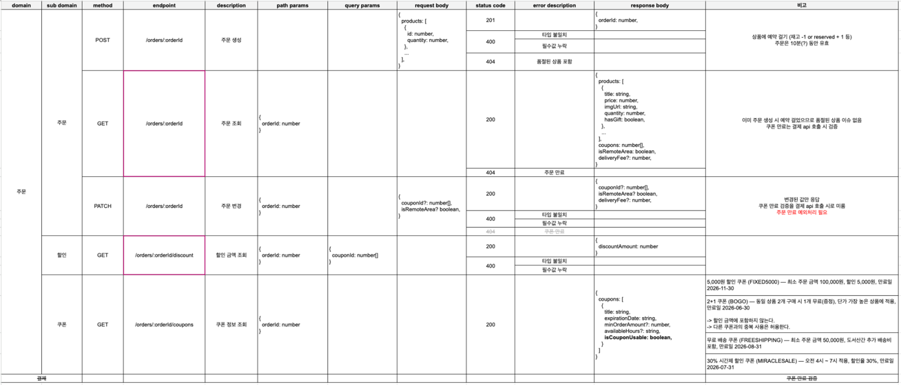

# API 명세서 
[스프레드시트 🔗](https://docs.google.com/spreadsheets/d/1SvIxcKaGHvVGesTzHZ6CAiv-TSV1QzqqHnmkl1qRpWI/)

동시성 문제를 해결하기 위한 방법으로 order를 생성하기로 결정했습니다.

쿠폰 또한 **주문 단위**로 적용되는 쿠폰이라는 명세를 보고 `/orders`의 하위로 포함시켰습니다. 주문 기반으로 쿠폰 리스트가 추출된다면 body로 주문 정보를 길게 담아 보내기보다는 주문 id만 보내는 게 나을 것이라고 판단했고, 주문 id를 body로 담아 보내기보다는 해당 주문에 종속되는 쿠폰을 받아온다는 의미가 더 RESTful하게 느껴졌기 때문입니다.

